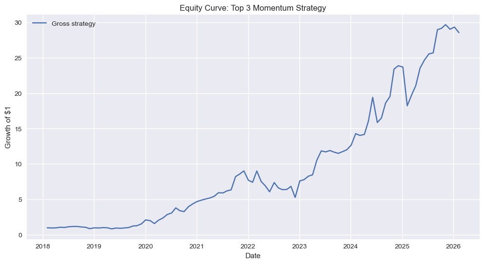
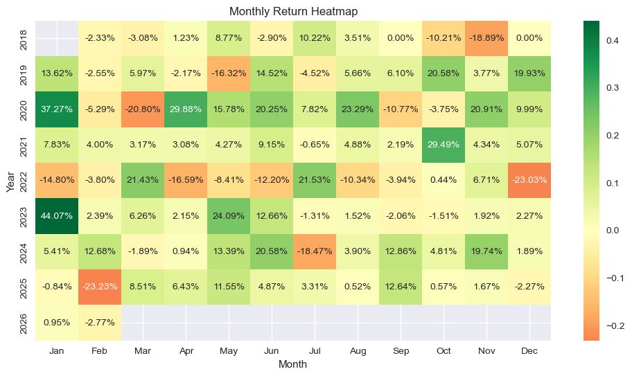

# Machine Learning Momentum Trading Strategy

This project builds a cross-sectional equity momentum strategy using machine learning.  
The model predicts 1-month forward stock returns using momentum and volatility features and constructs a monthly rebalanced portfolio.

---

## Strategy Overview

The workflow follows a typical quantitative research pipeline:

1. Collect historical stock data using Yahoo Finance
2. Engineer momentum and volatility features
3. Train a Ridge regression model
4. Rank stocks cross-sectionally based on predicted returns
5. Construct an equal-weighted long portfolio of the top-ranked stocks
6. Evaluate performance with transaction costs and volatility scaling

---

## Features Used

- 1-month momentum
- 3-month momentum
- 6-month momentum
- 12-month momentum
- 3-month volatility

These features are widely used in quantitative equity models.

---

## Portfolio Construction

Each month:

1. The model predicts forward returns for each stock.
2. Stocks are ranked cross-sectionally.
3. The strategy goes long the **top 3 stocks**.
4. The portfolio is **equal-weighted and rebalanced monthly**.

---

## Results

### Equity Curve



---

### Monthly Return Heatmap



---

### Performance Summary

| Metric       | Unscaled | Volatility Scaled |
|--------------|----------|-------------------|
| CAGR         | ~50%     | ~19%              |
| Sharpe Ratio | ~1.17    | ~1.22             |
| Max Drawdown | -42%     | -16%              |

Volatility scaling significantly reduces drawdowns while maintaining strong risk-adjusted performance.

---

## Technologies Used

- Python
- Pandas
- NumPy
- Scikit-Learn
- Matplotlib
- Seaborn
- yfinance

---

## Future Improvements

Potential extensions include:

- Expanding the stock universe (e.g. S&P 500)
- Testing additional models (Random Forest, XGBoost)
- Incorporating additional factors
- Improving transaction cost modeling

---

## Notebook

The full research workflow is available in:

```
momentum_strategy.ipynb
```

---
